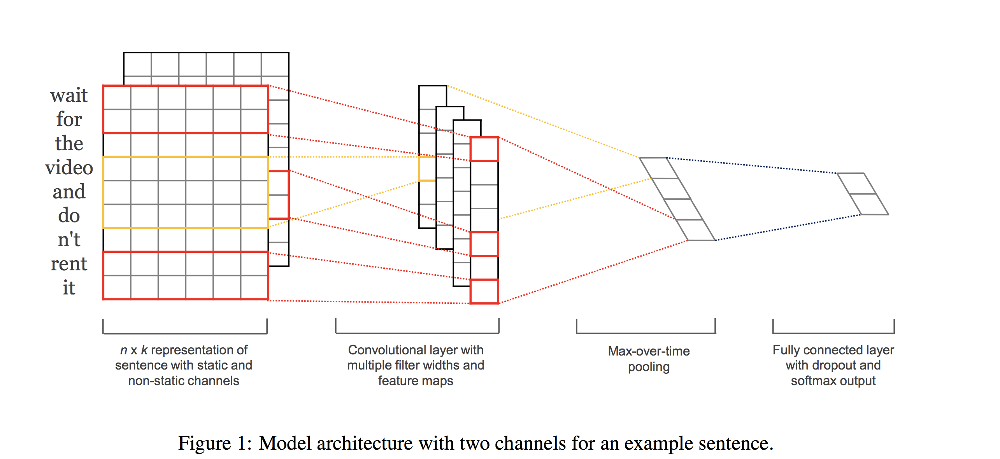
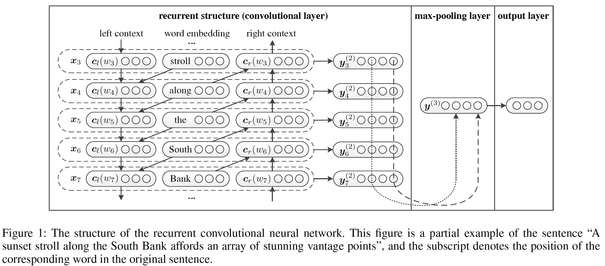

# Text classification
This repository contains some method to do text classification.

## dataset
[1] TREC

[2] 20newsgroup

[3] MR

## models
[1] TextCNN

[2] TextRNN

[3] RCNN

## result
(Measure: Accuracy on test data)

| Model        | Dataset  | MR   | TREC |
|--------------|:----------:|:------:|:----:|
| TextCNN(Rand)         | Results  | 67.7 | 88.2 |
|              | paper | 76.1 | 91.2 |
| TextCNN(Static)       | Results  | 79.7 | **93.4** |
|              | paper | 81.0 | 92.8 |
| TextCNN(Non-static)   | Results  | 80.1 | **0.902** |
|              | paper | 81.5 | 93.6 |
| TextCNN(Multichannel) | Results  | 79.8 | **92.8** |
|              | paper | 81.1 | 92.2 |

## reference
[1] [Text Classification Algorithms: A Survey(很不错的文本分类综述(2019))](https://arxiv.org/pdf/1904.08067.pdf)

[2] [Text Classification Algorithms: A Survey(从机器学习到深度学习的文本分类综述(2019))](https://github.com/kk7nc/Text_Classification)

[3] [用深度学习（CNN RNN Attention）解决大规模文本分类问题 - 综述和实践(一位阿里人的文本分类小综述，结合了实际问题和业务)](https://zhuanlan.zhihu.com/p/25928551)