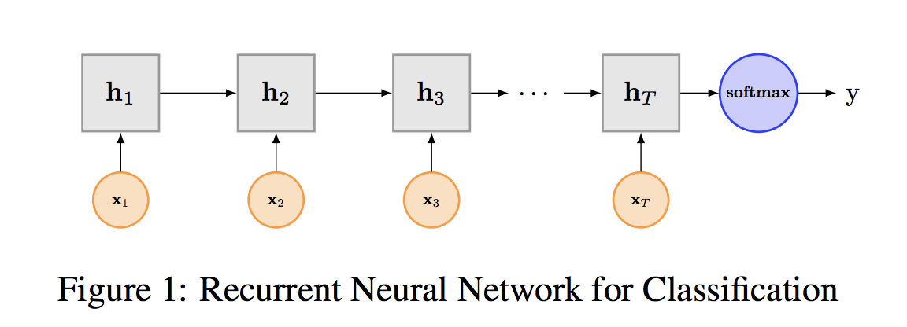

# Text classification
This repository contains some classical models to do text classification.

## Develop Requirements
- OS: Ubuntu 16.04 LTS (64bit)
- GPU: Nvidia Titan Xp
- Language: Python 3.6.2.
- Pytorch: **0.4.1**
- nltk==3.2.4
- tensorboardX==0.8
- torchtext==0.3.1

## Dataset
[1] **TREC**:  TREC question dataset—task involves classifying a question into 6 question
types (whether the question is about person,
location, numeric information, etc.)

[2] **20newsgroup**:  This dataset contains messages from twenty newsgroups. 

[3] **MR**: Movie reviews with one sentence per review. Classification involves detecting positive/negative reviews.

## Models
[1] [TextCNN](https://www.aclweb.org/anthology/D14-1181)

[2] [TextRNN](https://www.ijcai.org/Proceedings/16/Papers/408.pdf)

[3] [RCNN](https://pdfs.semanticscholar.org/eba3/6ac75bf22edf9a1bfd33244d459c75b98305.pdf)

## Excution
    python train.py -c config_cnn.json

## result
(Measure: Accuracy on test data)

| Model        | Dataset  | MR   | TREC |
|--------------|:----------:|:------:|:----:|
| TextCNN(Rand)         | Results  | 67.7 | 88.2 |
|              | paper | 76.1 | 91.2 |
| TextCNN(Static)       | Results  | 79.7 | **93.4** |
|              | paper | 81.0 | 92.8 |
| TextCNN(Non-static)   | Results  | 80.1 | 90.8 |
|              | paper | 81.5 | 93.6 |
| TextCNN(Multichannel) | Results  | 79.8 | **92.8** |
|              | paper | 81.1 | 92.2 |
| TextRNN| Results  | 80.9 | **94.4** |
|              | paper |  |  |
| TextRNN+Attention| Results  | 80.2 | **94.6** |
|              | paper |  |  |
| TextRCNN| Results  | 80.05 | **93.2** |
|              | paper |  |  |

## reference
[1] [Text Classification Algorithms: A Survey(很不错的文本分类综述(2019))](https://arxiv.org/pdf/1904.08067.pdf)

[2] [Text Classification Algorithms: A Survey(从机器学习到深度学习的文本分类综述(2019))](https://github.com/kk7nc/Text_Classification)

[3] [用深度学习（CNN RNN Attention）解决大规模文本分类问题 - 综述和实践(一位阿里人的文本分类小综述，结合了实际问题和业务)](https://zhuanlan.zhihu.com/p/25928551)